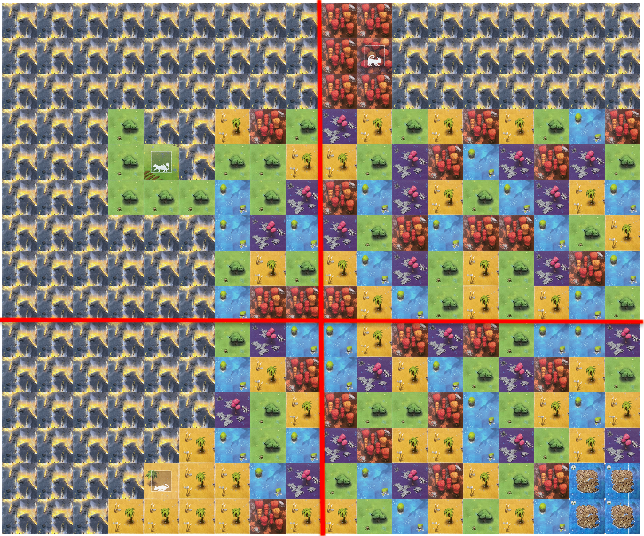
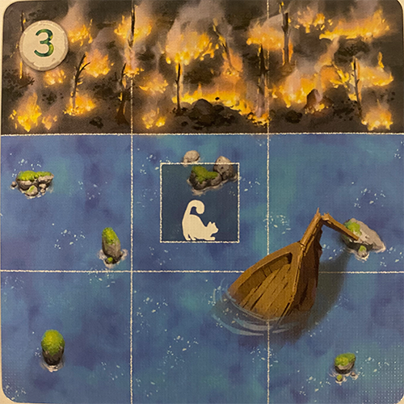
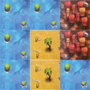
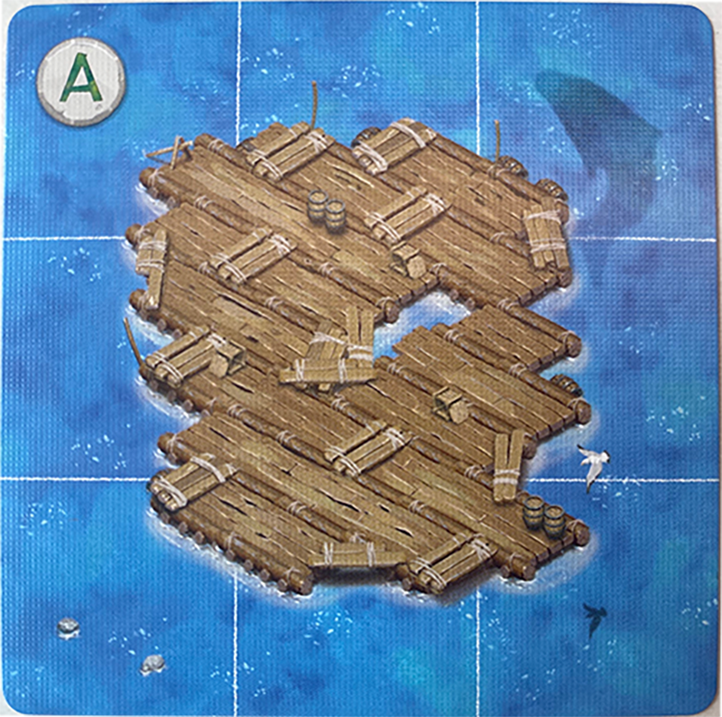

# Race to the Raft

## Problem Description - Race to the Raft

Race to the Raft is a game in which one to four players cooperate to manoeuvre a clowder of cats off a burning island
and onto a raft. The Isle of Cats, which used to be a safe haven for felines far and wide, has fallen to the armies of
the evil Lord Vesh. Now, the island is burning, and all the cats that remain must race to the safety of the raft.

Each player will build pathways for each cat to traverse. However, time is of the essence, as the cats cannot be trapped
by the fire that is engulfing the island.

The game is won if every cat has made it safely to the raft. But, if even one cat is unable to reach the raft, or the
entire island is on fire before the cats escape, the game is over!

**Important note:** We will be building a modified, solo variant of the game. The rules we are using are slightly
different to those printed in the official game rulebook. The rules of the game outlined in this document take
precedence over the rules of the actual game. Read this page carefully and ask on the course forum if you have any
questions.

## Challenges

Race to the Raft comes with pre-defined challenges which define the layout of the island, the starting location of each
cat, the location of the raft, and the extent to which the fire has already consumed the island.

Below is an example challenge setup:

## Playing Race to the Raft

There are three steps to each round in Race to the Raft:

1. Draw pathway cards;
2. Play or discard pathway cards to make pathways or move cats; and
3. Rest.

There is no fixed number of rounds in this game: the game continues until you win or lose.

### Step 1: Drawing Pathway Cards

The player draws six pathway cards from among the four decks. The player can draw these cards in any combination, from
any decks they wish. However, you are not allowed to look at the cards you have drawn until you have drawn all
six cards.

Decks are not replaced in this game. If a deck has no cards, you can no longer draw from that deck.
The game is lost if a player is unable to draw a card because all decks are empty.

### Step 2: Playing Pathway Cards

The player plays cards to move cats, or create paths to the island. All cards in their hand must be played before
the next step.

#### Action: Add Pathway

A player can place one pathway card from their hand onto the island. This placement must be consistent with
the [placement rules](#placing-cards-and-fire-tiles).

Afterwards, the player places a random fire tile on the island, also following the placement rules.

#### Placing Cards and Fire Tiles

- Pathway cards and fire tiles cannot have any of their squares hanging off the edge of the island.
- The squares of pathway cards and fire tiles must line up with the squares of the island.
- Pathway cards and fire tiles can be rotated in any orientation. Fire tiles can also be flipped, both horizontally and
  vertically.
- Pathway cards and fire tiles can fully or partially overlap other pathway cards.
- Pathway cards and fire tiles cannot overlap any squares with fire or any square belonging to a raft card.
- Pathway cards and fire tiles cannot overlap any squares with cats on them.
- Pathway cards and fire tiles cannot be placed under other pathway cards or fire tiles.
- Fire tiles must be placed next to existing fire. That is, at least one square of a fire tile being placed must touch
  at least one square of existing fire. Note that diagonals are not considered adjacent.
- Pathway cards do not have any adjacency requirements like fire tiles.

#### Action: Move a Cat

To move a cat:

1. Discard one card from your hand, or two cards if the cat is exhausted. Discarded cards are removed from
   the game, so we do not track the discard pile.
2. Move the cat along any number of orthogonally adjacent* squares of the same colour as
   the cat.
3. When you have finished moving the cat, the cat becomes exhausted for the rest of this round. If the cat was
   already exhausted, it remains exhausted.

Cats can move through squares occupied by other cats, but no two cats can occupy the same square.

*Given a square `s`, its orthogonally adjacent squares are the squares next to `s` and not diagonally adjacent to `s`.

### Step 3: Resting

All cards must be played from the player's hand. Once all cards have been played, any exhausted cats are no longer
exhausted and the player starts a new round, returning to Step 1.

### End of Game

#### Winning

You win if all the cats are on the raft card.

#### Losing

There are several ways that the game can be lost:

- If a player cannot place a fire tile on the island in a valid way according to the game rules;
- If there is no way for a cat to reach the raft;
- If a there are no more fire tiles remaining AND the player is required to draw one; or
- If there are no more pathway cards in any of the decks AND the player is required to draw a card.

## Component information

### Islands

The island is made up of several connected island boards, which have dimensions of either 9 x 6 or 9 x 9 squares.
The layout of the island will depend on the challenge that is being completed.
Each island board can optionally have a strip of fire along one of its edges
(for the 9 x 6 island boards, this is always along the shorter edge).

Island boards are chosen randomly, and rotated randomly, so long as they match the specifications of the challenge.
These specifications are:

1. The island boards are rotated correctly to form the correctly sized board; and
2. Any strips of fire that are stipulated in the challenge are reflected in the board setup.

### Cat Location Cards

Cat Location cards, with dimensions of 3 x 3 squares, denote the starting location of each cat to be used in a given
challenge. Each location card can be identified by its numerical ID. At the start of the game, a cat must be placed on
each square with a cat icon such that the colour of the cat and the square match.

### Pathway Cards

Each pathway card has dimensions of 3 x 3 squares, and contains a mixture of red, blue, green, yellow, and purple
squares.

There are four different decks of pathway cards: the cross deck, the square deck, the circle deck, and the triangle
deck.
Each deck has a different distribution of squares.
For example, 35% of the squares in the circle deck are red, 32% are blue, 17% are yellow, 16% are green, and 0% are
purple.
If a player were looking for a pathway card with multiple red squares,
it would be a good idea to take a pathway card from the circle deck.
However, if a player were looking for a pathway card with purple squares, they would not get such a pathway card from
the circle deck.

### Fire Tiles

Fire tiles are Tetris-shaped blocks of fire, which are placed on the board throughout the duration of the game.

### Raft Cards

Observe raft card A:

Because there are no cat icons on this raft card, any cat can move onto the raft from any orthogonal direction (north,
south, east, or west).
A cat may not be moved again after it has arrived at one of the eight outer squares of the raft.

Let's compare raft card A with raft card B:

This raft card has specific colours surrounding the raft. A cat may only end on the raft on the coloured square
matching its own colour. The three squares in the bottom right corner of this card that do not have a cat image on
them are wild spaces. A cat of any colour may end on these spaces, like in raft card A above.

